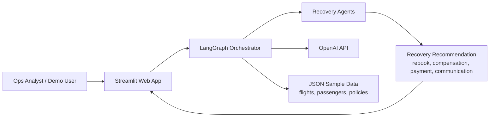
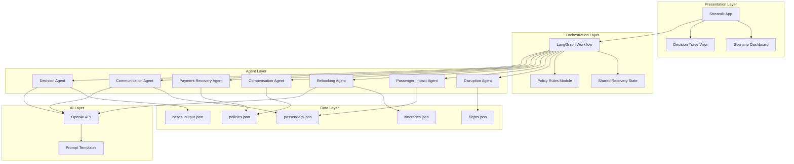
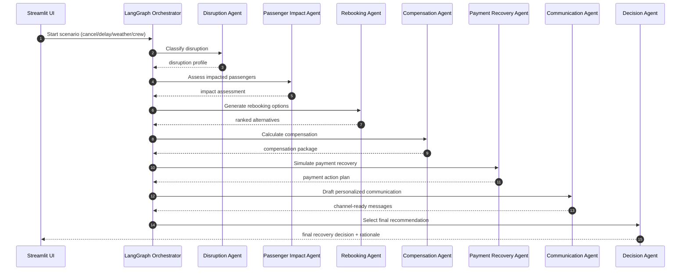
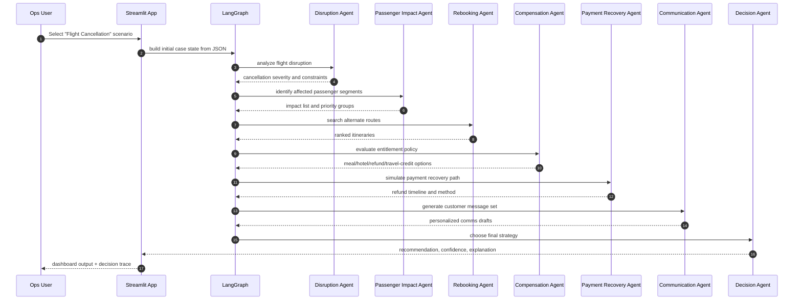
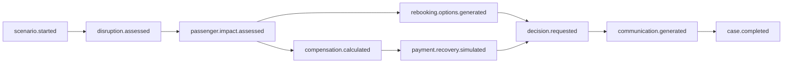
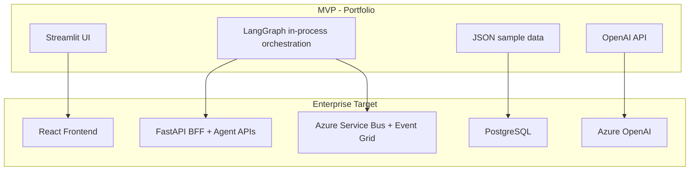

# SkyRecoverAI Architecture (MVP - Python + Streamlit)

## Executive Summary

SkyRecoverAI is a portfolio project that simulates how a major airline handles passenger recovery during disruption events. The MVP is intentionally simple, local-first, and fully executable without cloud infrastructure or databases.

The system uses a multi-agent workflow built with LangGraph and OpenAI API, exposed through a Streamlit interface. It ingests JSON sample data for flights, passengers, and policies, then orchestrates specialized agents to produce rebooking, compensation, payment recovery, and communication decisions.

### MVP Outcomes
- Demonstrate end-to-end disruption handling for cancellation, delay, weather, and crew scenarios.
- Show agent collaboration and auditable decisioning.
- Keep architecture cleanly evolvable into enterprise stack components later.

### Hard Constraints Applied
- Python only.
- Streamlit UI.
- LangGraph orchestration.
- OpenAI API.
- JSON sample data only.
- Hugging Face deployment target.
- No cloud dependencies in runtime architecture.
- No Azure dependencies.
- No database for MVP.

---

## Solution Architecture

### Functional Scope
- Detect and classify disruption type.
- Identify impacted passengers and connection risk.
- Generate alternative itinerary options from sample schedules.
- Calculate compensation and payment recovery recommendations.
- Produce personalized passenger messages.
- Select final strategy via Decision Agent.

### Architecture Style
- Single deployable Streamlit app for MVP.
- Internal event-style workflow using LangGraph state transitions.
- JSON files act as source-of-truth and state snapshots.
- Deterministic policy logic + LLM-assisted reasoning.

---

## Context Diagram



### Context Notes
- User triggers disruption scenarios through Streamlit controls.
- All input data is loaded from local JSON files.
- OpenAI API is the only external runtime dependency.

---

## Component Diagram



---

## Agent Interaction Diagram



---

## Sequence Diagram (Cancellation Example)



---

## Event Model (MVP Internal Events)



### Event Semantics
- Events are represented as state transitions in LangGraph nodes.
- Each transition appends to an in-memory audit trail.
- Final state is optionally persisted to cases_output.json.

---

## Folder Structure (GitHub Ready)

```text
SkyRecoverAI/
  README.md
  requirements.txt
  .env.example
  app.py

  docs/
    architecture.md
    prompts.md

  data/
    flights.json
    passengers.json
    itineraries.json
    policies.json
    scenarios/
      cancellation_case.json
      delay_case.json
      weather_case.json
      crew_case.json
    output/
      cases_output.json

  src/
    graph/
      workflow.py
      state.py
      events.py

    agents/
      disruption_agent.py
      passenger_impact_agent.py
      rebooking_agent.py
      compensation_agent.py
      payment_recovery_agent.py
      communication_agent.py
      decision_agent.py

    services/
      openai_client.py
      policy_engine.py
      itinerary_service.py
      recommendation_service.py

    ui/
      pages/
        1_Scenario_Simulator.py
        2_Decision_Trace.py
      components/
        case_summary.py
        recommendation_panel.py

    models/
      domain.py
      dto.py

    utils/
      json_store.py
      logger.py
      config.py

  tests/
    test_agents.py
    test_workflow.py
    test_policy_engine.py

  deployment/
    huggingface/
      README.md
      app_hf.py
```

---

## Hugging Face Deployment (MVP)

### Target
- Deploy as a Streamlit Space on Hugging Face.

### Packaging Approach
- Keep dependencies minimal in requirements.txt.
- Use .env for OPENAI_API_KEY in local dev.
- In Hugging Face Spaces, configure OPENAI_API_KEY as repository secret.
- Load JSON sample data from repository paths.

### Runtime Characteristics
- Stateless app behavior for demo sessions.
- Output snapshots written to data/output/cases_output.json if writable.
- If write access is constrained, keep outputs in session state only.

---

## Future Enterprise Architecture (Evolution Path)

The MVP is intentionally modular so each layer can be replaced without rewriting agent business logic.

### Target Evolution Stack
- Frontend: React.
- API: FastAPI.
- Persistence: PostgreSQL.
- LLM provider: Azure OpenAI.
- Messaging backbone: Azure Service Bus + Event Grid.

### Evolution Diagram



### Migration Strategy
1. Extract Streamlit orchestration endpoints into FastAPI while keeping LangGraph graphs unchanged.
2. Replace JSON storage adapters with PostgreSQL repositories.
3. Externalize internal events to Service Bus topics and Event Grid.
4. Move Decision Trace view from Streamlit to React operations console.
5. Swap OpenAI client configuration from public API to Azure OpenAI endpoint.

### Architecture Guardrails for Easy Migration
- Keep agents framework-agnostic and UI-agnostic.
- Use interfaces for data store, message bus, and LLM client.
- Keep domain event contracts versioned from day one.
- Centralize policy logic outside prompts.

---

## Summary

SkyRecoverAI MVP delivers a complete local-first simulation of airline disruption recovery using Python, Streamlit, LangGraph, OpenAI API, and JSON data. It demonstrates seven-agent orchestration with auditable decisioning and provides a clean migration path to React, FastAPI, PostgreSQL, and Azure messaging/LLM services when scaling to enterprise architecture.
