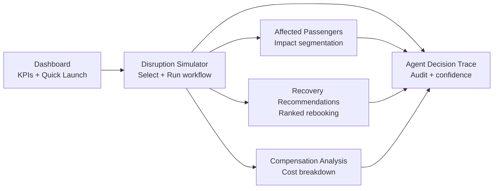

# SkyRecoverAI Dashboard Wireframes

## Design System

| Token | Value |
|---|---|
| Primary accent | `#1f77b4` |
| Danger / Critical | `#dc3545` |
| Warning / High | `#fd7e14` |
| Medium severity | `#ffc107` |
| Success / Low | `#198754` |
| Muted | `#6c757d` |
| Layout | Wide — full browser width |
| Sidebar | Expanded, Streamlit native |

---

## Navigation

```
Sidebar
├── ✈️  SkyRecoverAI  (Dashboard)
├── ⛈️  Disruption Simulator
├── 🧳  Affected Passengers
├── 🔁  Recovery Recommendations
├── 💰  Compensation Analysis
└── 🔍  Agent Decision Trace
```

---

## Page 1 — Dashboard

```
╔══════════════════════════════════════════════════════════════════════╗
║  ✈️ SkyRecoverAI                                                     ║
║  Agentic AI platform for airline disruption recovery · Portfolio     ║
╠══════════════════════════════════════════════════════════════════════╣
║  ┌──────────────┐ ┌──────────────┐ ┌──────────────┐ ┌────────────┐ ║
║  │ Active       │ │ Flights      │ │ Passengers   │ │ Est. Cost  │ ║
║  │ Disruptions  │ │ Impacted     │ │ Impacted     │ │            │ ║
║  │     1        │ │     18       │ │     284      │ │  $42,600   │ ║
║  └──────────────┘ └──────────────┘ └──────────────┘ └────────────┘ ║
╠══════════════════════════════════════════════════════════════════════╣
║  ┌─────────────────────────────────────────────────────────────────┐║
║  │  Active Case · CASE-3F8A2B1D                                    ║
║  │  ⛈️ ATL Thunderstorm  · Airport: ATL  · Root Cause: Weather    ║
║  │  Strategy: REBOOK + MEAL + HOTEL  |  Confidence: 87%           ║
║  │  ⚠️ Human review required                                       ║
║  └─────────────────────────────────────────────────────────────────┘║
╠══════════════════════════════════════════════════════════════════════╣
║  Quick Launch Scenarios                                              ║
║  ┌───────────────────┐ ┌────────────────────┐ ┌──────────────────┐ ║
║  │ ⛈️ ATL Thunderstorm│ │ 🚫 Cancellation SR110│ │ 👨‍✈️ Crew SR245  │ ║
║  │ Severity: Critical│ │ Severity: Critical  │ │ Severity: Medium │ ║
║  │ Airport: ATL      │ │ Airport: JFK        │ │ Airport: LHR     │ ║
║  │ Flights: 18       │ │ Flights: 1          │ │ Flights: 1       │ ║
║  │ Pax: 284          │ │ Pax: 147            │ │ Pax: 96          │ ║
║  │ [▶ Run Simulation]│ │ [▶ Run Simulation]  │ │ [▶ Run Simulation│ ║
║  └───────────────────┘ └────────────────────┘ └──────────────────┘ ║
╚══════════════════════════════════════════════════════════════════════╝
```

**Components:** `st.metric` × 4 · `st.container(border=True)` for active case banner · 3-column scenario cards with `st.button`

---

## Page 2 — Disruption Simulator

```
╔══════════════════════════════════════════════════════════════════════╗
║  ⛈️ Disruption Simulator                                             ║
║  Select a disruption scenario and trigger the AI recovery workflow   ║
╠══════════════════════════════════════════════════════════════════════╣
║  ◉ ⛈️ ATL Thunderstorm   ○ 🚫 Cancellation SR110   ○ 👨‍✈️ Crew SR245 ║
╠══════════════════════════════════════════════════════════════════════╣
║  ┌──────────────────────────────────┐ ┌──────────────────────────┐  ║
║  │ ⛈️ ATL Thunderstorm              │ │  Flights Affected:  18   │  ║
║  │                                  │ │  Passengers:       284   │  ║
║  │ Severe thunderstorm over ATL.    │ │  Estimated Delay: 195 min│  ║
║  │ FAA ground stop issued.          │ │  Compensation: Meal+Hotel│  ║
║  │ Severity: [Critical]             │ │                          │  ║
║  │ Root Cause: Weather              │ │                          │  ║
║  └──────────────────────────────────┘ └──────────────────────────┘  ║
╠══════════════════════════════════════════════════════════════════════╣
║  AI Recovery Pipeline                                                ║
║  ┌──────┐ ┌──────┐ ┌──────┐ ┌──────┐ ┌──────┐ ┌──────┐ ┌──────┐  ║
║  │  1   │ │  2   │ │  3   │ │  4   │ │  5   │ │  6   │ │  7   │  ║
║  │Disrpt│ │Pax   │ │Rebook│ │Comp  │ │Pymnt │ │Comms │ │Decis │  ║
║  │Agent │ │Impact│ │Agent │ │Agent │ │Agent │ │Agent │ │Agent │  ║
║  └──────┘ └──────┘ └──────┘ └──────┘ └──────┘ └──────┘ └──────┘  ║
╠══════════════════════════════════════════════════════════════════════╣
║  [═══════════════ 🚀 Run AI Recovery Workflow (primary button) ════] ║
║  ████████████████████████████████████░░░ Running CompensationAgent… ║
╠══════════════════════════════════════════════════════════════════════╣
║  ✅ Case CASE-3F8A2B1D created                                       ║
║  ┌──────────────────┐ ┌─────────────────┐ ┌──────────────────────┐ ║
║  │ Passengers: 284  │ │ Strategy:        │ │ Confidence: 87%      │ ║
║  │                  │ │ REBOOK+MEAL+HTOL │ │                      │ ║
║  └──────────────────┘ └─────────────────┘ └──────────────────────┘ ║
╚══════════════════════════════════════════════════════════════════════╝
```

**Components:** `st.radio(horizontal=True)` · 2-col detail card · 7-col pipeline visual (HTML cards) · `st.progress` live animation · `st.metric` results row

---

## Page 3 — Affected Passengers

```
╔══════════════════════════════════════════════════════════════════════╗
║  🧳 Affected Passengers                                              ║
╠══════════════════════════════════════════════════════════════════════╣
║  ┌──────┐ ┌──────────┐ ┌──────────┐ ┌──────────┐ ┌──────────────┐ ║
║  │ 284  │ │ 🔴 24    │ │ 🟠 87    │ │ ⚪ 173   │ │ Connections  │ ║
║  │ Total│ │ Critical │ │   High   │ │ Standard │ │   at Risk: 99│ ║
║  └──────┘ └──────────┘ └──────────┘ └──────────┘ └──────────────┘ ║
╠══════════════════════════════════════════════════════════════════════╣
║  [Priority Groups] [Loyalty Tiers] [Ticket Classes] [SSR Requests] ║
║  ┌────────────────────────────────────────────┐                     ║
║  │ █████████████████████████ Standard: 173    │                     ║
║  │ ████████████ High: 87                      │                     ║
║  │ ████ Critical: 24                          │                     ║
║  └────────────────────────────────────────────┘                     ║
╠══════════════════════════════════════════════════════════════════════╣
║  Passenger Detail                                                    ║
║  [Search name…] [Loyalty tier ▼] [Class ▼] [Priority ▼]            ║
║  ┌────────────┬────────────┬────────┬──────────┬──────────┬──────┐  ║
║  │ Name       │ Tier       │ Class  │ Priority │ Conn.    │Score │  ║
║  ├────────────┼────────────┼────────┼──────────┼──────────┼──────┤  ║
║  │ Emma Rodrz │ Gold       │ Bsns   │ Critical │ Yes      │ ████ │  ║
║  │ Noah Kim   │ None       │ Economy│ Standard │ No       │ ██   │  ║
║  │ Yuki Tanka │ Platinum   │ Prm Ec │ High     │ Yes      │ ███  │  ║
║  └────────────┴────────────┴────────┴──────────┴──────────┴──────┘  ║
╚══════════════════════════════════════════════════════════════════════╝
```

**Components:** `st.metric` × 5 · `st.tabs` × 4 · `st.bar_chart` · filtered `st.dataframe` with `ProgressColumn`

---

## Page 4 — Recovery Recommendations

```
╔══════════════════════════════════════════════════════════════════════╗
║  🔁 Recovery Recommendations                                         ║
╠══════════════════════════════════════════════════════════════════════╣
║  ℹ️ Dear Passenger, we sincerely apologise for the weather           ║
║     disruption. We have prepared personalised recovery options…      ║
╠══════════════════════════════════════════════════════════════════════╣
║  Ranked Rebooking Options                                            ║
║  ┌──────────────────────────────────────────────────────────────┐   ║
║  │ ⭐ Best Option                   Seats: 42   Delay: +4 hrs  │   ║
║  │  ✈️ SR410  ATL→ORD  +4 h        Score: ████████████░  88%   │   ║
║  │  Cabin: Economy                                              │   ║
║  └──────────────────────────────────────────────────────────────┘   ║
║  ┌──────────────────────────────────────────────────────────────┐   ║
║  │  Option 2                        Seats: 61   Delay: +6 hrs  │   ║
║  │  ✈️ SR412  ATL→ORD  +6 h        Score: ████████████   82%   │   ║
║  └──────────────────────────────────────────────────────────────┘   ║
╠══════════════════════════════════════════════════════════════════════╣
║  Comparison Table                                                    ║
║  ┌────────┬────────────────────┬──────────┬───────┬─────────────┐  ║
║  │ Option │ Flight             │ Delay(h) │ Seats │ Score (%)   │  ║
║  ├────────┼────────────────────┼──────────┼───────┼─────────────┤  ║
║  │ OPT-1  │ SR410 ATL→ORD +4h │    4     │  42   │ ████░  88.0 │  ║
║  │ OPT-2  │ SR412 ATL→ORD +6h │    6     │  61   │ ████░  82.0 │  ║
║  └────────┴────────────────────┴──────────┴───────┴─────────────┘  ║
╠══════════════════════════════════════════════════════════════════════╣
║  Agent Strategy Decision                                             ║
║  Strategy: REBOOK + MEAL + HOTEL     Confidence: 87%                ║
║  Rationale: Disruption severity Critical. 284 pax impacted at ATL.  ║
║  ⚠️ Human-in-the-Loop review required before execution.            ║
╚══════════════════════════════════════════════════════════════════════╝
```

**Components:** `st.info` banner · bordered `st.container` option cards · `confidence_bar` HTML component · `st.dataframe` with `ProgressColumn`

---

## Page 5 — Compensation Analysis

```
╔══════════════════════════════════════════════════════════════════════╗
║  💰 Compensation Analysis                                            ║
╠══════════════════════════════════════════════════════════════════════╣
║  ┌──────────┐ ┌──────────┐ ┌──────────┐ ┌──────────┐ ┌──────────┐ ║
║  │ Total    │ │ Meal     │ │ Hotel    │ │ Refunds  │ │ Travel   │ ║
║  │ $42,600  │ │ $7,100   │ │ $42,600  │ │  $0      │ │ Credit   │ ║
║  │          │ │($25/pax) │ │($150/pax)│ │          │ │  $0      │ ║
║  └──────────┘ └──────────┘ └──────────┘ └──────────┘ └──────────┘ ║
╠══════════════════════════════════════════════════════════════════════╣
║  [Cost Breakdown] [By Loyalty Tier] [Per-Passenger Estimate]        ║
║  ┌────────────────────────────────┐                                  ║
║  │ Hotel Vouchers ████████████    │                                  ║
║  │ Meal Vouchers  ██              │                                  ║
║  └────────────────────────────────┘                                  ║
╠══════════════════════════════════════════════════════════════════════╣
║  Payment Recovery Plan                                               ║
║  ┌────────────────────┐ ┌────────────────┐ ┌──────────────────────┐ ║
║  │ Mode: Travel Credit│ │ Amount:$42,600 │ │ ETA: 3–5 bus. days   │ ║
║  └────────────────────┘ └────────────────┘ └──────────────────────┘ ║
╚══════════════════════════════════════════════════════════════════════╝
```

**Components:** `st.metric` × 5 · `st.tabs` × 3 · `st.bar_chart` · `st.dataframe` full passenger cost table · `st.metric` × 3 for payment plan

---

## Page 6 — Agent Decision Trace

```
╔══════════════════════════════════════════════════════════════════════╗
║  🔍 Agent Decision Trace                                             ║
╠══════════════════════════════════════════════════════════════════════╣
║  Case: CASE-3F8A2B1D  │  Scenario: ATL Thunderstorm  │  Strategy:  ║
║                         REBOOK + MEAL + HOTEL                        ║
╠══════════════════════════════════════════════════════════════════════╣
║  Total Agents: 7   │  Total Latency: 8.8 s  │  Avg. Confidence: 92% ║
╠══════════════════════════════════════════════════════════════════════╣
║  Agent Pipeline Execution                                            ║
║  ▼ ✅ Step 1 · DisruptionAgent · disruption.assessed     [expanded] ║
║    │ Confidence ████████████████████████░  95%                       ║
║    │ Latency: 0.4 s  │  Status: ✅ Success                           ║
║    │ Disruption type weather classified. Severity Critical…          ║
║  ▶ ✅ Step 2 · PassengerImpactAgent · passenger.impact…  [collapsed] ║
║  ▶ ✅ Step 3 · RebookingAgent · rebooking.options…       [collapsed] ║
║  ▶ ✅ Step 4 · CompensationAgent · compensation…         [collapsed] ║
║  ▶ ✅ Step 5 · PaymentRecoveryAgent · payment…           [collapsed] ║
║  ▶ ✅ Step 6 · CommunicationAgent · communication…       [collapsed] ║
║  ▶ ✅ Step 7 · DecisionAgent · decision.finalized        [collapsed] ║
╠══════════════════════════════════════════════════════════════════════╣
║  Confidence Summary                                                  ║
║  Step 1 · DisruptionAgent      ████████████████████░  95%           ║
║  Step 2 · PassengerImpactAgent ██████████████████░    92%           ║
║  Step 3 · RebookingAgent       █████████████████░     88%           ║
║  Step 4 · CompensationAgent    ████████████████████░  97%           ║
║  Step 5 · PaymentRecoveryAgent ██████████████████░    91%           ║
║  Step 6 · CommunicationAgent   ███████████████████░   94%           ║
║  Step 7 · DecisionAgent        █████████████████░     89%           ║
╠══════════════════════════════════════════════════════════════════════╣
║  Final Decision                                                      ║
║  Strategy: REBOOK + MEAL + HOTEL   Confidence: 87%                  ║
║  Rationale: Disruption severity Critical. 284 pax impacted at ATL.  ║
║  ⚠️ Human review required — decision cannot be auto-executed.       ║
╠══════════════════════════════════════════════════════════════════════╣
║  ▶ View complete workflow state (JSON) [collapsed expander]          ║
╚══════════════════════════════════════════════════════════════════════╝
```

**Components:** `st.metric` × 6 · `st.expander` per agent (first 2 open) · `confidence_bar` HTML component × 7 · `st.json` in expander

---

## User Flow



---

## Session State Flow

```
User selects scenario
        │
        ▼
run_scenario(key) → sim_result dict
        │
        ▼
st.session_state["sim_result"] = sim_result
        │
        ├── Dashboard reads sim_result → KPI metrics
        ├── Affected Passengers reads sim_result["passengers"]
        ├── Recovery Recommendations reads sim_result["rebooking_options"]
        ├── Compensation Analysis reads sim_result["compensation"]
        └── Agent Decision Trace reads sim_result["audit_trail"]
```
