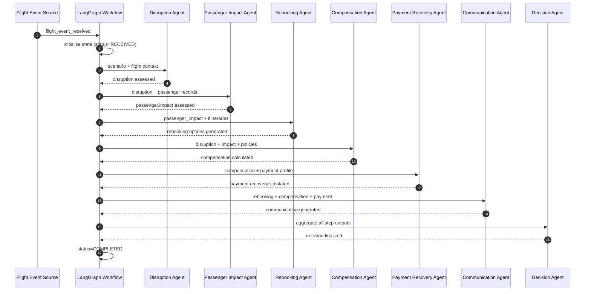
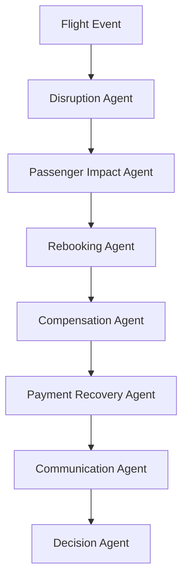

# SkyRecoverAI LangGraph Workflow Design

## Overview

This document defines the end-to-end LangGraph workflow for SkyRecoverAI.

Workflow order:

Flight Event -> Disruption Agent -> Passenger Impact Agent -> Rebooking Agent -> Compensation Agent -> Payment Recovery Agent -> Communication Agent -> Decision Agent

---

## Shared State Model

The workflow operates on a single mutable graph state (`RecoveryState`) with append-only audit events.

Core state fields:
- case_id
- correlation_id
- scenario
- disruption
- passenger_impact
- rebooking_options
- compensation_package
- payment_recovery_plan
- communication_bundle
- final_decision
- errors
- audit_trail
- status

State lifecycle:
- `RECEIVED` -> `IN_PROGRESS` -> `DECISION_READY` -> `COMPLETED`
- Any fatal step failure sets `status=FAILED`.

---

## Step 0: Flight Event

### Input
- Flight event payload (`cancellation`, `delay`, `weather`, `crew`)
- Case metadata (`case_id`, timestamp, source)

### Output
- Initialized workflow state
- Event marker: `scenario.started`

### State Changes
- Set `status=RECEIVED`
- Populate `scenario`
- Initialize `errors=[]` and `audit_trail=[]`

### Error Handling
- Invalid schema: reject event and write to `errors`
- Missing required keys: assign `status=FAILED`

---

## Step 1: Disruption Agent

### Input
- `scenario`
- Flight operational context

### Output
- `disruption`
  - `type`
  - `severity`
  - `affected_flights`
  - `confidence`
- Event marker: `disruption.assessed`

### State Changes
- Set `status=IN_PROGRESS`
- Write `disruption`
- Append disruption trace entry to `audit_trail`

### Error Handling
- Validation failure: emit `DISRUPTION_VALIDATION_ERROR`
- Timeout: retry with backoff; fallback to deterministic classification

---

## Step 2: Passenger Impact Agent

### Input
- `disruption`
- Passenger and itinerary records

### Output
- `passenger_impact`
  - `impacted_passenger_ids`
  - `priority_groups`
  - `impact_scores`
  - `connection_risk`
- Event marker: `passenger.impact.assessed`

### State Changes
- Write `passenger_impact`
- Append impact trace to `audit_trail`

### Error Handling
- Missing passenger data: set partial mode and continue with warning
- Empty impact set: continue to downstream steps with no-op flags

---

## Step 3: Rebooking Agent

### Input
- `passenger_impact`
- Itinerary inventory and policy constraints

### Output
- `rebooking_options`
  - `candidates`
  - `ranked`
  - `policy_violations`
  - `confidence`
- Event marker: `rebooking.options.generated`

### State Changes
- Write `rebooking_options`
- Append rebooking trace to `audit_trail`

### Error Handling
- No inventory available: set `rebooking_options.ranked=[]` and flag `NO_REBOOKING_AVAILABLE`
- LLM failure: keep deterministic ranking without narrative

---

## Step 4: Compensation Agent

### Input
- `disruption`
- `passenger_impact`
- Policy configuration

### Output
- `compensation_package`
  - `meal_voucher`
  - `hotel_voucher`
  - `refund_eligibility`
  - `travel_credit_offer`
  - `compliance_notes`
- Event marker: `compensation.calculated`

### State Changes
- Write `compensation_package`
- Append compensation trace to `audit_trail`

### Error Handling
- Policy config missing: set `status=FAILED`
- Rule conflict: apply precedence and add warning to `errors`

---

## Step 5: Payment Recovery Agent

### Input
- `compensation_package`
- Payment profile and settlement rules

### Output
- `payment_recovery_plan`
  - `recommended_mode`
  - `amount`
  - `settlement_eta`
  - `fallback_mode`
- Event marker: `payment.recovery.simulated`

### State Changes
- Write `payment_recovery_plan`
- Append payment trace to `audit_trail`

### Error Handling
- Missing payment profile: fallback to travel credit
- Settlement service timeout: mark deferred execution and continue

---

## Step 6: Communication Agent

### Input
- `rebooking_options`
- `compensation_package`
- `payment_recovery_plan`
- Passenger profile and templates

### Output
- `communication_bundle`
  - `sms`
  - `email`
  - `push`
  - `localization_status`
- Event marker: `communication.generated`

### State Changes
- Write `communication_bundle`
- Append communication trace to `audit_trail`

### Error Handling
- Template missing: fallback to safe default template
- Channel payload too long: auto-truncate and annotate warning

---

## Step 7: Decision Agent

### Input
- `disruption`
- `passenger_impact`
- `rebooking_options`
- `compensation_package`
- `payment_recovery_plan`
- `communication_bundle`

### Output
- `final_decision`
  - `strategy`
  - `confidence`
  - `rationale`
  - `human_review_required`
- Event marker: `decision.finalized`

### State Changes
- Write `final_decision`
- Set `status=DECISION_READY`
- Append final trace to `audit_trail`
- Set `status=COMPLETED` after response packaging

### Error Handling
- Missing upstream outputs: set `status=FAILED`
- Low confidence: set `human_review_required=true` and continue with conditional completion

---

## Mermaid Sequence Diagram (Happy Path)



---

## Mermaid Sequence Diagram (Failure and Recovery Path)

```mermaid
sequenceDiagram
    autonumber
    participant LG as LangGraph Workflow
    participant R as Rebooking Agent
    participant C as Compensation Agent
    participant PR as Payment Recovery Agent
    participant DE as Decision Agent

    LG->>R: Run rebooking step
    R-->>LG: NO_REBOOKING_AVAILABLE
    LG->>LG: errors += warning; continue

    LG->>C: Compensation-heavy fallback path
    C-->>LG: compensation.calculated

    LG->>PR: simulate payment recovery
    PR-->>LG: payment.recovery.simulated

    LG->>DE: Evaluate available outputs
    DE-->>LG: strategy=COMPENSATION_FIRST, human_review_required=false
    LG->>LG: status=COMPLETED
```

---

## LangGraph Node-to-Node Edges



---

## Implementation Notes

- Each node should return a partial state patch; the graph reducer merges patches into `RecoveryState`.
- Each node should append a normalized trace object:
  - `step`
  - `status`
  - `latency_ms`
  - `warnings`
  - `error_code` (optional)
- Use retry policies only on transient failures; do not retry schema errors.
- Keep deterministic fallbacks for every LLM-dependent step.
